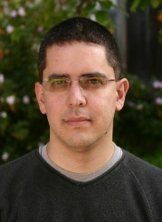

.. _personal:

==========
 Fernando
==========

I'm a scientist and a geek, and thus I spend much of my time in front of either
the computer or a book.  If not there, you may find me climbing (hopefully
outdoors!) and probably with a camera.  Mostly of interest to friends and
family, I keep my pictures online at a `picasa album`__.

__ _picasa_fperez

I also have a blog_, where I mostly post items of interest related to IPython,
SciPy and scientific computing in Python.  I haven't been able to really get
caught up in the whole blogging thing, so it's rather sparse, but people tell
me it's useful, so I may try to post more, we'll see...

The picture at the top is Colorado's beautiful Continental Divide, shot from
the `Brainard Lake`_ area during a `beautiful fall day`_ in 2004.  On the
descent from that hike I spotted a great-looking little couloir that provided
for a very nice `alpine day`_ one week later.  Having that terrain 45 minutes
from home is one thing that makes the Colorado Front Range the most amazing
place to live I've known.

.. _Brainard Lake: http://maps.google.com/maps/place?cid=1317471477502605538&q=brainard+lake,+colorado&hl=en
.. _beautiful fall day: http://picasaweb.google.com/fdo.perez/MountTollInTheFall
.. _alpine day: http://picasaweb.google.com/fdo.perez/CouloirLittlePawneePeak

.. include:: links.txt
