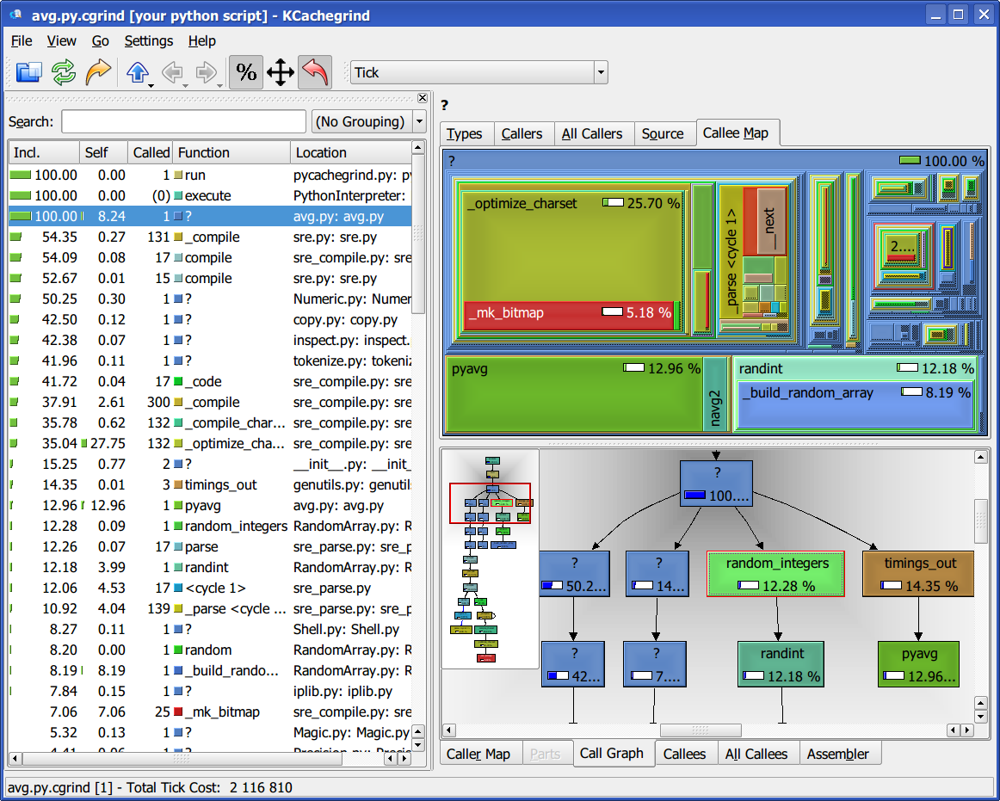

=========================================
 Profiling Python codes with KCacheGrind
=========================================

Utilities for Profiling
=======================

This directory contains some simple utilities to assist in the profiling of
Python programs using the ``hotshot`` profiler (which is more accurate than the
``profile`` module) and the KCacheGrind visualizer.

Copy the following file somewhere in your ``$PATH`` and make it executable.  It
contains a detailed docstring with usage information:

  - pycachegrind.py_ (here_ is a syntax-highlighted HTML version)

.. _here: pycachegrind.html

If you have any problems with the default setup, copy this as well and modify
the source in pycachegrind.py to use it instead:

  - hotshot2cachegrind.py_

Recent installations of kcachegrind should already include the
``hotshot2calltree`` tool needed to convert hotshot output into something that
kcachegrind understands, so you should in principle not need the second file.

This is the kind of call graph visualization that you can expect to obtain
(click on the image to enlarge it):

Caveats
=======

Please note that profiling Python codes accurately is not particularly easy,
given the interplay at runtime between the Python interpreter itself and
extension code written in C.  These_ two_ links provide some extra details on
the matter.

Licensing
=========

 - pycachegrind.py: BSD
 - hotshot2cachegrind.py: GPL (from its original author)

Acknowledgements
================

This code is heavily inspired in scripts written by Arnd Baecker and Nikolai
Hlubek, and posted to the SciPy mailing lists.  Hotshot2cachegrind was written
by Joerg Beyer, the code linked above is his unmodified original.

  
.. Targets:
.. _pycachegrind.py: pycachegrind.py
.. _hotshot2cachegrind.py: hotshot2cachegrind.py
.. _These: https://mail.enthought.com/pipermail/enthought-dev/2006-January/001075.html
.. _two: http://aspn.activestate.com/ASPN/Mail/Message/numpy-discussion/3117563

..
   Local Variables:
   mode: rst
   End:
